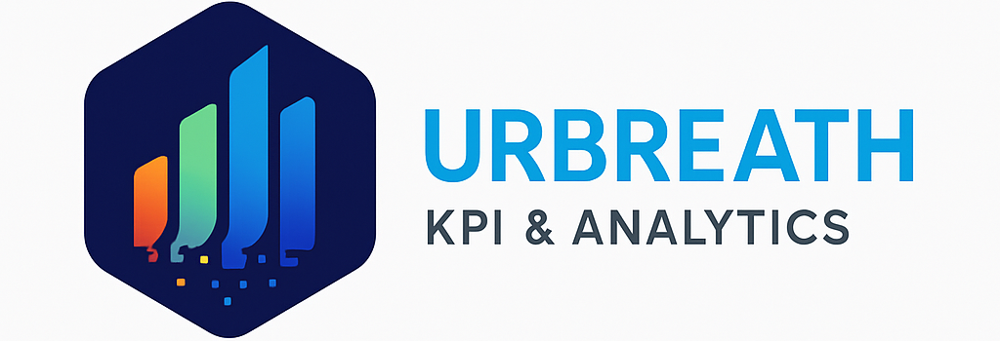

This repository contains a data visualization tool built on top of Apache Superset. The dashboard allows users to explore, analyse, and monitor data in real time through an interactive and customizable interface. It offers dynamic and interactive visualizations, advanced filters for targeted analysis, and a scalable, modular architecture powered by Apache Superset. The tool is configurable with multiple levels of access and security and provides a web-based, user-friendly interface. The main goal of the project is to provide a ready-to-use solution for building business dashboards that enable organizations to make data-driven decisions with ease

---

## 🚀 Demo

  


---

## 📦 Installazione

Clona il progetto e installa le dipendenze:

```bash
git clone https://github.com/URBREATH/Superset.git
npm install
